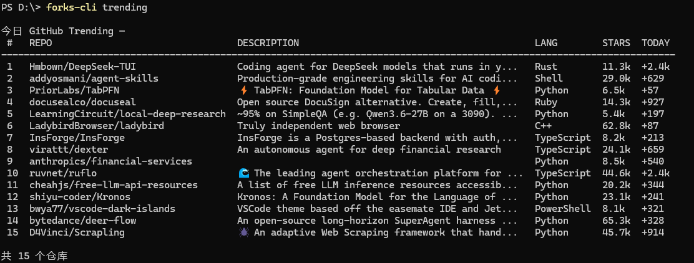
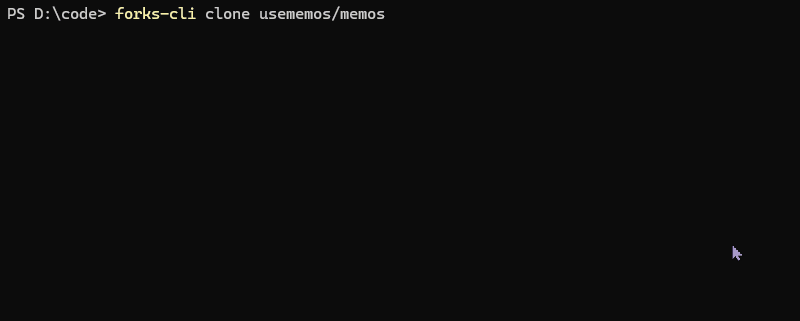
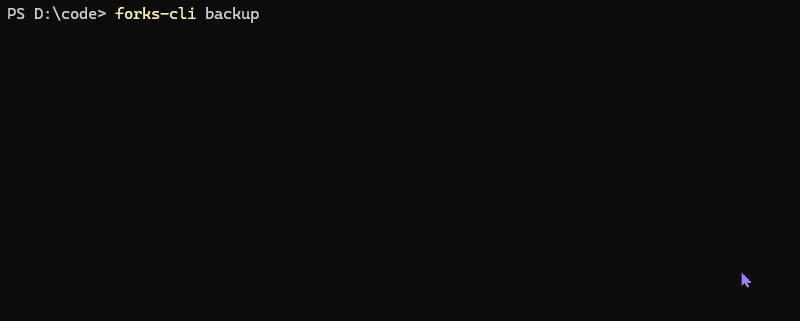

# forks-cli

**[中文](#功能概览)** | **[English](README_EN.md)**

> Forks 服务端命令行工具 — 镜像加速克隆、批量备份、GitHub Trending 浏览，配合 [Forks](https://github.com/cicbyte/forks) 服务端使用

> CLI tool for [Forks](https://github.com/cicbyte/forks) server — accelerated cloning, batch backup, and GitHub Trending browsing

## 功能概览

| 命令 | 说明 |
|------|------|
| `forks-cli clone` | 通过 Forks 镜像加速克隆 Git 仓库 |
| `forks-cli backup` | 从服务端批量备份仓库到本地 |
| `forks-cli trending` | 浏览 GitHub Trending 趋势仓库 |
| `forks-cli config` | 管理应用配置（list/get/set） |
| `forks-cli website` | 在浏览器中打开 Forks Web UI |
| `forks-cli version` | 查看版本信息 |

## 截图

### Trending 趋势浏览



### 镜像加速克隆



### 批量备份



## 安装

从 [Releases](https://github.com/cicbyte/forks-cli/releases) 下载对应平台的二进制文件，或自行构建：

```bash
git clone https://github.com/cicbyte/forks-cli.git
cd forks-cli
go build -o forks-cli
```

环境要求：Go 1.23+

## 快速开始

```bash
# 配置 Forks 服务端地址
forks-cli config set server http://192.168.1.100:8080

# 配置 API Token
forks-cli config set token <your-token>

# 加速克隆仓库
forks-cli clone golang/go

# 浏览今日趋势
forks-cli trending

# 批量备份到指定目录
forks-cli backup -d /data/backup
```

## 使用方法

### clone — 镜像加速克隆

支持三种仓库地址格式：

```bash
# 简写（推荐）
forks-cli clone author/repo

# 原始 URL
forks-cli clone https://github.com/author/repo

# 镜像 URL
forks-cli clone http://host:port/git/github/author/repo.git
```

| 选项 | 说明 |
|------|------|
| `-t, --token` | 本次使用的 Token（不保存） |
| `-s, --server` | 本次使用的服务端地址 |
| `-f, --force` | 强制更新镜像缓存 |

### backup — 批量备份

从 Forks 服务端获取仓库列表，批量克隆或更新到本地目录。

```bash
# 备份到指定目录（必须指定）
forks-cli backup -d /data/backup

# 使用配置文件中的路径
forks-cli config set backup_dir /data/backup
forks-cli backup

# 自定义并发数
forks-cli backup -d /data/backup -c 10
```

| 选项 | 说明 |
|------|------|
| `-d, --dir` | 备份目录（必填，或通过 config 设置） |
| `-c, --concurrency` | 并发数（默认 5） |
| `-t, --token` | 本次使用的 Token |
| `-s, --server` | 本次使用的服务端地址 |

### trending — GitHub 趋势

```bash
# 今日全部语言
forks-cli trending

# 指定语言和时间范围
forks-cli trending -l go -s weekly

# 中文趋势
forks-cli trending -S zh

# 查看历史数据
forks-cli trending -d 2026-05-04

# JSON 格式输出
forks-cli trending --format json
```

| 选项 | 说明 |
|------|------|
| `-l, --language` | 编程语言（go/python/rust/...） |
| `-s, --since` | 时间范围：daily/weekly/monthly（默认 daily） |
| `-S, --spoken` | 自然语言（zh/en） |
| `-d, --date` | 指定日期（2026-05-04） |
| `--refresh` | 跳过缓存重新获取 |

### config — 配置管理

```bash
# 查看所有配置
forks-cli config list

# 设置配置项
forks-cli config set server http://192.168.1.100:8080
forks-cli config set token              # 交互式输入（不回显）
forks-cli config set log.level debug

# 查看单个配置
forks-cli config get server
forks-cli config get token --show       # 显示明文
```

配置项列表：

| 键名 | 说明 |
|------|------|
| `server` | Forks 服务端地址 |
| `token` | API Token（敏感字段） |
| `backup_dir` | 备份目录 |
| `log.level` | 日志级别（debug/info/warn/error） |
| `log.max_size` | 单个日志文件最大 MB |
| `log.max_backups` | 保留日志备份数 |
| `log.max_age` | 日志保留天数 |
| `log.compress` | 是否压缩日志 |

### website — 打开 Web UI

```bash
forks-cli website
```

## 全局选项

| 选项 | 说明 |
|------|------|
| `--format` | 输出格式：table/json/jsonl（默认 table） |

## 配置优先级

Token 和 Server 支持多级优先级：

```
命令行参数 > 环境变量 > 配置文件
```

环境变量：`FORKS_TOKEN`

## 配置文件

配置文件路径：`~/.cicbyte/forks-cli/config/config.yaml`

```yaml
server: http://192.168.1.100:8080
token: your-api-token
backup_dir: /data/backup
log:
  level: info
  maxSize: 10
  maxBackups: 30
  maxAge: 30
  compress: true
```

## 许可证

[MIT](LICENSE) © 2026 cicbyte
